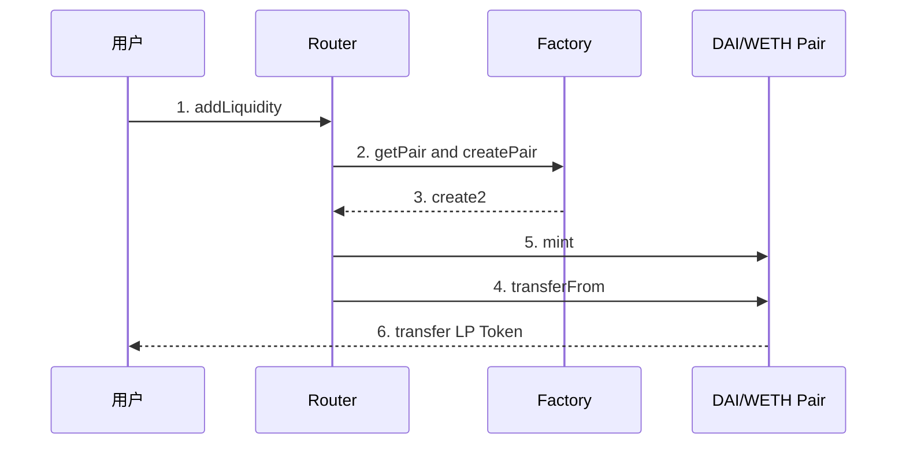

https://www.bilibili.com/video/BV1wroWYpEuR?spm_id_from=333.788.videopod.sections&vd_source=ee9606370e95d9f0d4577d8e55116dfd

- [x] 恒定乘积自动做市商算法 ✅ 2025-05-25
- [x] Uniswap简介 ✅ 2025-05-25
- [x] Uniswap V2里的swap操作 ✅ 2025-05-26
- [x] Uniswap V2里的手续费机制 ✅ 2025-06-02
- [x] Uniswap V2里的添加/移除流动性 ✅ 2025-06-11
- [x] Uniswap V2里的无常损失 ✅ 2025-06-12
- [x] Uniswap V2里的Flash Swaps ✅ 2025-06-13
- [x] Uniswap V2里的TWAP ✅ 2025-06-13

### 恒定乘积自动做市商算法
1. 公式：
$$
x \cdot y = k
$$
2. 用户卖出tokenx
$$
(x + d_x) \cdot (y-d_y) = k = x \cdot y
$$
3.  token价格表示，用spot price
$$
P_x = \frac{x}{y}
$$
4. 滑点(slippage)的概念：取决于池子的深度，execution price的价格，跟spot price可能会有比较大的差距
$$
滑点 = \frac{执行价格-预期价格}{预期价格} \cdot 100\%
$$
5. 流动性L一般用平方号来表示，如果是平方变，就不是线形变化，为了衡量线形的，使用开根号处理
$$
\sqrt{x \cdot y} = L
$$
6. 流动性：添加流动性，或者移除流动性，都不能改变token的价格，添加流动性了以后，最后移除流动性的时候，会按照最新的市场价格获取对应的token，不一定跟添加的时候相等。恒定乘积的意思是说，交换的时候k保持不变。添加或者移除流动性，k其实是变化的。
$$
\frac{x+d_x}{y+d_y} = \frac{x}{y}
$$

### Uniswap简介
这个圈子，能把项目做起来，一个是营销，一个是技术，但是目前，仍然还是营销多于技术
学习到：不要浮躁，做一些长期的事

### Uniswap V2里的swap操作
1. 用户交互的流程
User -> Router02.sol -> Pair合约 -> User
2. 路由合约提供交换的path
3. 收手续费的时候，是token进来的时候收的
4. getAmountOut公式：
$$
d_y = \frac{(1-f)d_x \cdot y_0}{(1-f)d_x+x_0}
$$
5. getAmountIn公式：
$$
d_x = \frac{x_0d_y}{y_0-d_y} \cdot \frac{1}{(1-f)}

$$
6. x对应的是进来的token数量，y对应的是出去的token数量
7. 代码里add(1)是一个向上取整的操作
### Uniswap V2里的手续费机制
1. 扣除的千分之三，token数量都放pair里面了，所以流动性会缓慢增长 
2. 手续费的分配，是按照lp token的占比来分配，如果不考虑添加或者移除流动性，lpt会越来越值钱
3. protocol fee 的收取是在mint函数实现的，如果打开开关，每次mint的时候，都会给项目方mint对应的lpt
4. 手续费增加的比例公式；
$$
f_1,_2 = \frac{\sqrt{k_2} - \sqrt{k_1}}{\sqrt{k_2}} = 1- \frac{\sqrt{k_1}}{\sqrt{k_2}}
$$
5. 手续费的比例计算，从开始进入流动性开始，到退出流动性，在这期间的手续费累积
6. 项目方新增发的share mint 逻辑。
$$
\frac{S_m}{S_m + S_1} =\frac{ \varnothing \cdot (\sqrt{k_2} - \sqrt{k_1})}{\sqrt{k_2}}=\varnothing \cdot f_1,_2
$$
7. 就是应该给项目方增发多少新的lp token？从做大的蛋糕里面进行计算

### Uniswap V2里的添加/移除流动性
1. 计算添加流动性的数量：
投入d_x，d_y，获取的lp token数量，设为s，这个S怎么求？
$$
\frac{L_1-L_0}{L_0} = \frac{S}{T}
$$
T是之前的totalSupply
$$
S = \frac{L_1-L_0}{L_0} \cdot T =\frac{\sqrt{(x_0+d_x) \cdot (y_0+d_y)}-\sqrt{x_0y_0}} {\sqrt{x_0y_0}} = \frac{d_x}{x_0} \cdot T = \frac{d_y}{y_0} \cdot T
$$
因为智能合约的实现时，会有计算精度的问题，所以我们取S：
$$
S = min(\frac{d_x}{x_0} \cdot T , \frac{d_y}{y_0} \cdot T)
$$

2. 计算移除流动性的数量
$$
\frac{L_0-L_1}{L_0} = \frac{S}{T}
$$
这里含义有点不一样，移除流动性，说明L0会比L1大
$$
d_x=\frac{S}{T} \cdot x_0 
$$

$$
d_y=\frac{S}{T} \cdot y_0 
$$
### Uniswap V2里的无常损失
1.  什么是无常损失？增长幅度不如当时不做LP，少赚的部份，就是无常损失
初始LP：100 DAI / 1 ETH，这个时候值200usd
ETH涨价：120 DAI / 0.83 ETH，这个时候ETH价格为120/0.83 = 144.58 DAI，这个时候LP价值：120 DAI + 0.83 * 144.58 = 240 usd
如果他不做LP：100 DAI + 1 ETH = 100 + 144.8 = 244.58 DAI
无常损失：244.58 - 240 = 4.58
2. 降价的时候的无常损失。多跌的那部份，就是无常损失
初始LP：100 DAI / 1 ETH，这个时候值200usd
ETH降价：80 DAI / 1.25 ETH，这个时候ETH价格为80/1.25 = 64 DAI，这个时候LP价值：80 DAI + 1.25 * 64 = 160 usd
如果他不做LP：100 DAI + 1 ETH = 100 + 1 * 64 = 164 DAI

3. 价格的变化和无常损失的关系（无常损失：impermenant loss，简称IL）
$$
P = \frac{y}{x}
$$
$$
x \cdot y = k = L^2
$$
$$
L = \sqrt{x \cdot y}
$$
可以推演出以下公式：
$$
y=L \cdot \sqrt{P}
$$
$$
x=\frac{L}{\sqrt{P}}
$$

$$
IL = \frac{做LP导致的损失}{不做LP的token价值} = \frac{V_1 - V_hold}{V_hold}
$$
V1：在t1时刻，池子里token的价值
V_hold：在t1时刻，如果不做lp，token的价值
d：价格变化的因子，在0-1之间，价格下跌，大于1，价格上涨
价格的变化与无常损失的关系：(先不推演了，好麻烦。。)
$$
IL(d) = \frac{2\sqrt{d}}{1+d} -1
$$

### Uniswap V2里的Flash Swaps
1. 手续费计算：
$$
fee = \frac{3}{997}dx_0
$$
### Uniswap V2里的TWAP
spot price:当前池子状态的价格，y/x

$$
TWAP = \frac{priceCumulative_2-priceCumulative_1}{timestamp_2-timestamp_1}=\frac{48120-11400}{1583535828-1583532228}=10.2
$$